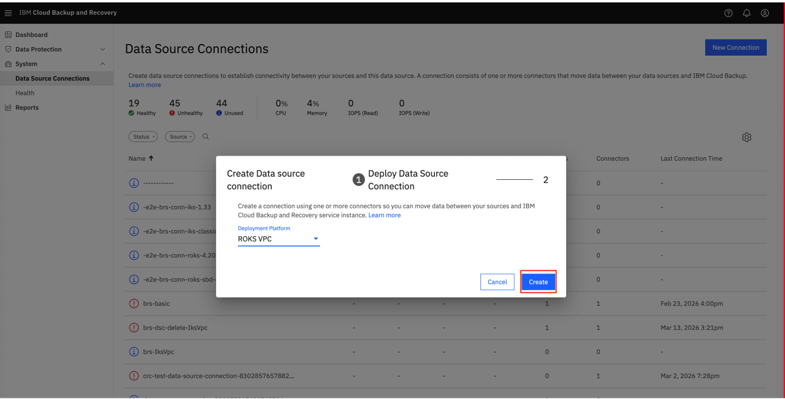
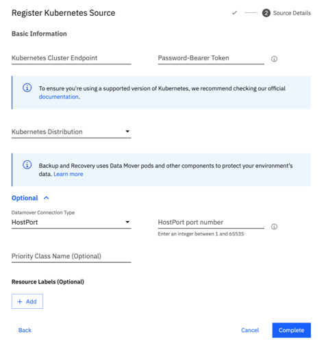

---

copyright:
  years: 2025, 2026
lastupdated: "2026-04-16"

keywords: data source connector, iks, roks, cluster

subcollection: backup-recovery


---

{{site.data.keyword.attribute-definition-list}}

# Register Kubernetes or OpenShift as a data source
{: #data-source-connector-iks-roks}

This information is provided for beta use only and is subject to change. Only the regions us-east, us-south, and eu-es are available now for this feature.
{: beta}


Located to the right of this page is a summary of key topics that are found on this page.
{: note}

## Quick reference to key sections for new users
{: #iks-roks-tutorial-quick-reference}

A. [Before you begin](#baas-getting-started-iks-roks)

B. Prerequisites for backup and restore:
   - You must have a [{{site.data.keyword.baas_full_notm}} instance that is created or create a new one](#data-source-connector-iks-roks-access-instance)
   - [Create or use existing data source connector](#data-source-connector-iks-roks-create-configure)
   - [Kubernetes or OpenShift cluster must be registered](#data-source-connector-iks-roks-register)

C. Take a backup of the Kubernetes or OpenShift cluster:
   - [Access {{site.data.keyword.baas_full_notm}} instance](#data-source-connector-iks-roks-access-instance)
   - [Create and configure data source connector](#data-source-connector-iks-roks-create-configure)
   - [Register source Kubernetes or OpenShift cluster](#data-source-connector-iks-roks-register)
   - [Create or schedule a backup](/docs/backup-recovery?topic=backup-recovery-protecting-namespace-iks-roks)

D. Restore backup to Kubernetes or OpenShift cluster:
   - [Access {{site.data.keyword.baas_full_notm}} instance](#data-source-connector-iks-roks-access-instance)
   - [Create and configure data source connector](#data-source-connector-iks-roks-create-configure)
   - [Register source Kubernetes or OpenShift cluster](#data-source-connector-iks-roks-register)
   - [Restore backup](/docs/backup-recovery?topic=backup-recovery-recovering-restoring-backup)

E. [Troubleshooting](/docs/backup-recovery?topic=backup-recovery-data-source-connector-iks-roks-troubleshooting)

## Before you begin
{: #baas-getting-started-iks-roks}

You need the following to get started with {{site.data.keyword.baas_full_notm}} with Kubernetes or OpenShift:
- An [{{site.data.keyword.cloud}} Platform account](https://cloud.ibm.com)
- An active instance of [{{site.data.keyword.baas_full_notm}} service](https://cloud.ibm.com/catalog/services/backup-and-recovery?catalog_query=aHR0cHM6Ly9jbG91ZC5pYm0uY29tL2NhdGFsb2cjaGlnaGxpZ2h0cw%3D%3D)

Alternatively, you can use the pre-built, open-source, and enterprise-ready [Terraform IBM modules](/docs/ibm-cloud-provider-for-terraform?topic=ibm-cloud-provider-for-terraform-about-tim) with {{site.data.keyword.baas_full_notm}} service. These modules provide best practices for provisioning {{site.data.keyword.cloud_notm}} resources and can be referenced directly in your Terraform configurations.

## Accessing your {{site.data.keyword.baas_full_notm}} instances
{: #data-source-connector-iks-roks-access-instance}

1. Verify that your [IBM Cloud Platform account](https://cloud.ibm.com/){: external} has access to the required {{site.data.keyword.baas_full_notm}} service.
    1. Go to `Navigation Menu` \> `Backup and Recovery`.
    2. On the **Backup service instances** page, use the search bar to find your instance by name.
    3. Identify the instance with **Active** status and click its name.
    4. On the instance details page, click `Launch dashboard`.


## Backup requirements for Kubernetes or OpenShift clusters
{: #data-source-connector-iks-roks-backup-requirements}

Your Kubernetes or OpenShift cluster must be registered with the {{site.data.keyword.baas_full_notm}} instance to:

- Take backups
- Restore backups

## Backup and Restore compatibility
{: #data-source-connector-iks-roks-brs-comp}

You can back up and restore data on:

- The same Kubernetes or OpenShift cluster
- A different Kubernetes or OpenShift cluster within the same region
- Kubernetes or OpenShift cluster scoped resources, namespaces, and the resources within namespaces.

Clusters must be compatible, especially in terms of storage and network configuration.
{: note}

## Kubernetes and OpenShift Architecture Overview
{: #data-source-connector-iks-roks-architecture}

The {{site.data.keyword.baas_full_notm}} service for Kubernetes and OpenShift uses a distributed architecture with the following key components:

- **Data Source Connector**: Deployed in your cluster as a Helm chart, it establishes secure communication between your cluster and the {{site.data.keyword.baas_full_notm}} service. The connector acts as a bridge, enabling the service to discover and manage backup operations.

- **Backup Agent Components**: After source registration, additional components are automatically deployed:
  - **Datamover**: Deployed as a DaemonSet on all worker nodes, it handles data transfer operations during backup and restore. The Datamover reads data from persistent volumes and streams it to the backup storage.
  - **Velero**: An open-source Kubernetes backup tool that manages the backup and restore of Kubernetes resources (deployments, services, config maps, etc.) and coordinates with the Datamover for persistent volume data.

- **CSI Snapshots**: When available, the service leverages Container Storage Interface (CSI) snapshots for efficient, storage-level backups. If CSI snapshots are not supported by your storage provider, the system automatically falls back to filesystem-based backups using the Datamover.

This architecture ensures that both Kubernetes metadata and persistent volume data are protected, enabling complete cluster recovery when needed.

## Create or configure a data source connector
{: #data-source-connector-iks-roks-create-configure}

To back up and restore Kubernetes or OpenShift clusters, you must set up a data source connector. This process involves two main steps:

1. **Create a data source connection** in the {{site.data.keyword.baas_full_notm}} dashboard (or use an existing connection if available)
2. **Install the Data Source Connector** on your Kubernetes or OpenShift cluster by using Helm

The data source connection establishes the communication channel between your {{site.data.keyword.baas_full_notm}} instance and your cluster. You can reuse an existing connection for multiple clusters if they are on the same deployment platform, or create a new connection for different platforms.

### Resource requirements for backup components
{: #data-source-connector-iks-roks-resource-reqs}

Ensure that the node has sufficient CPU and memory to run the {{site.data.keyword.baas_full_notm}} components. The Data Source Connector is installed first to establish connectivity. During source registration, additional backup agent components (Datamover and Velero) are deployed to the cluster. The following table lists their resource requirements.

The Datamover is installed by default on all worker nodes as a DaemonSet (not on control plane nodes) after the source registration is complete.
{: note}

| Pod Name                                   | CPU Requests | Memory Requests |
|--------------------------------------------|--------------|-----------------|
| Data Source Connector (per replica, default `replicaCount` is 2) | 2*2=4            | 5*2=10Gi             |
| Datamover (DaemonSet, deployed during registration) | 500m*N         | 128Mi*N           |
| Velero (deployed during registration)                                     | 500m         | 128Mi           |


### Create a data source connection
{: #data-source-connector-iks-roks-create-data-source-connection}

You can either create a new data source connection or use an existing one. If you already have a connection for the same deployment platform, you can skip to [Install and configure the data source connector](#data-source-connector-iks-roks-install-configure).

The current release of the `ibmcloud backup-recovery data-source-connection create` CLI command does not support the `--connection-env-type` parameter, which is required for creating connections that can be used to protect IBM Kubernetes Service and Red Hat OpenShift clusters. Until this limitation is resolved, use the UI-based workflow described below to create data source connections for backing up IBM Kubernetes Service and Red Hat OpenShift clusters.
{: important}

#### Choosing the deployment platform
{: #data-source-connector-iks-roks-deployment-platform}

Select the deployment platform that matches your cluster type and infrastructure:

- **ROKS VPC**: Red Hat OpenShift Kubernetes Service clusters on VPC infrastructure
- **IKS VPC**: IBM Kubernetes Service clusters on VPC infrastructure
- **ROKS classic**: Red Hat OpenShift Kubernetes Service clusters on classic infrastructure
- **IKS classic**: IBM Kubernetes Service clusters on classic infrastructure

The deployment platform must match your cluster's actual infrastructure type. You can verify your cluster type in the IBM Cloud Console under `Navigation Menu` > `Containers` > `Clusters`.
{: important}

#### Steps to create a new connection
{: #data-source-connector-iks-roks-create-new-connection}

1. Access the [{{site.data.keyword.baas_full_notm}} instance dashboard](#data-source-connector-iks-roks-access-instance).
2. Go to `Dashboard` > `System` > `Data Source Connections`.
3. Check whether an existing connection is available for your deployment platform. If yes, you can use it and skip to [Install and configure the data source connector](#data-source-connector-iks-roks-install-configure).
4. To create a new connection, click `New Connection`.
5. In the **Create data source connection** wizard:
   - **Step 1: Create data source connection**:
     - Select the **Deployment Platform** that matches your cluster (for example, **ROKS VPC**, **IKS VPC**, **ROKS classic**, **IKS classic**).
     - Click `Create`.
   - **Step 2: Install Data Source Connectors**:
     - Copy the provided `helm install` command. Save it securely, as you need it in the next step.
     - Click `Done`.
6. (Optional) Manage the data source connection by using the **Actions** menu (three vertical dots):
   - **Rename Connection**: Change the connection name for easier identification.
   - **Add Connector**: Retrieve the `helm install` command again if needed to deploy connectors on additional clusters.

    {: caption="Data source connections"}

   

### Install and configure the data source connector
{: #data-source-connector-iks-roks-install-configure}

After you create a data source connection, you must install and configure the Data Source Connector on your Kubernetes or OpenShift cluster. For detailed instructions, including resource requirements, Helm install commands, and customization options, see [Install Data Source Connector for Kubernetes or OpenShift](/docs/backup-recovery?topic=backup-recovery-deploy_data_source_connector#install_data_source_connector_iks_roks).

## How to get the Kubernetes or OpenShift cluster endpoint
{: #how-to-get-iks-roks-endpoint}

1. Log in to the [IBM Cloud Console](https://cloud.ibm.com/){: external}.
2. Go to `Navigation Menu` \> `Containers` \> `Clusters`.
3. Select your cluster. You might need to filter by location (for example, _Washington DC_).
4. On the **Overview** page, scroll to the **Networking** section to find the **Private** and **Public** service endpoints.

**Example endpoint format:**
- Private: `https://c102.private.eu-es.containers.cloud.ibm.com:30339`
- Public: `https://c102.eu-es.containers.cloud.ibm.com:30339`

## How to register a Kubernetes or OpenShift cluster with {{site.data.keyword.baas_full_notm}}
{: #data-source-connector-iks-roks-register}

If you are registering a cluster that was previously registered as a source, you must help ensure that any remnant `brs-backup-agent-<uuid>` namespaces are deleted from the cluster before proceeding. The presence of these namespaces causes the new source registration to fail.
{: important}

1. Access the [{{site.data.keyword.baas_full_notm}} instance dashboard](#data-source-connector-iks-roks-access-instance).
2. Go to: `Dashboard` \> `Data Protection` \> `Sources` \> click `Register Source`.
3. In the **Select Source** page, select the `Kubernetes Cluster (Beta)` tile and click `Start Registration`.
4. In the **Register Kubernetes Source** wizard:

    **Step 1: Data Source Connection**

    *   Select the previously created [Data Source Connection](#data-source-connector-iks-roks-create-data-source-connection), or create a new connection.
    *   Click `Continue`.

    **Step 2: Source Details**

    *   Enter the following details in the **Basic Information** section:

        |  Cluster Endpoint  |  Password-Bearer Token |  Kubernetes Distribution  |
        |----|----|----|
        | [Private (Recommended) or Public](#how-to-get-iks-roks-endpoint) | [See How to create a Bearer Token](#data-source-connector-iks-roks-create-bearer-token-cluster) | IBM Kubernetes Service / IBM Red Hat OpenShift Kubernetes Service |

        Make sure that **Kubernetes Distribution** matches the **Deployment Platform** of the selected Data Source Connection.

    *   (Optional) Configure Optional settings (for example, Service Type, Images) by expanding the **Optional** section.

         HostPort is the default and recommended communication method for the backup and recovery agent. Users can optionally specify a custom port; if not specified, the default port (33769) is used.

         | **Source**             | **Destination** | **Port** | **Protocol** | **Purpose**                               |
         |------------------------|-----------------|----------|--------------|--------------------------------------------|
         | Data Source Connector  | HOST            | 33769    | TCP          | Communication with backup and recovery agent             |

        {: caption="Register Kubernetes source"}

5. Click `Complete` to finish the source registration.

    The source registration process can take approximately 5 minutes to complete.
    {: note}

6. You are redirected to the **Sources** page, where you can view the status of your registered source.

## How to create a bearer token for a Kubernetes or OpenShift cluster
{: #data-source-connector-iks-roks-create-bearer-token-cluster}

**For clusters with private endpoints only:** You must run `ibmcloud`, `kubectl`, and `helm` commands from [IBM Cloud Shell](https://cloud.ibm.com/shell).

**For clusters with public endpoints:** You can run `ibmcloud`, `kubectl`, and `helm` commands from either [IBM Cloud Shell](https://cloud.ibm.com/shell) or your local workspace.
{: note}

1. Open [IBM Cloud Shell](https://cloud.ibm.com/shell) (or use your local workspace if your cluster has a public endpoint) and configure `kubectl` or `helm` CLI by getting the kube config:

    ```sh
    ibmcloud ks cluster config --cluster <cluster> --admin
    ```
    {: codeblock}

2. Create the service account and cluster role binding:

    ```sh
    kubectl create serviceaccount brs-sa -n default
    kubectl create clusterrolebinding brs-cl-role --clusterrole=cluster-admin --serviceaccount=default:brs-sa
    ```
    {: codeblock}

3. Create the secret and retrieve the bearer token:

    ```sh
    cat <<EOF > brs-sa-token.yaml
    apiVersion: v1
    kind: Secret
    metadata:
      name: brs-sa-token
      namespace: default
      annotations:
        kubernetes.io/service-account.name: brs-sa
    type: kubernetes.io/service-account-token
    EOF
    kubectl apply -f brs-sa-token.yaml
    ```
    {: codeblock}

    Wait a moment for the token to populate, then retrieve and decode it:

    ```sh
    kubectl get secret brs-sa-token -n default -o jsonpath='{.data.token}' | base64 --decode && echo ""
    ```
    {: codeblock}

## Upgrading the Backup Agent Components
{: #upgrade-brs-backup-agent}

When new releases of the {{site.data.keyword.baas_full_notm}} service become available, there is a possibility that new Backup Agent Component versions are also available. It is recommended to upgrade your Backup Agent Components when new releases become available to ensure that you have the latest features, security patches, and bug fixes.

To check for new service releases, see the [{{site.data.keyword.baas_full_notm}} release notes](https://cloud.ibm.com/docs/backup-recovery?topic=backup-recovery-updates){: external}.

Upgrades for the brs-backup-agent components are currently manual. When you register a Kubernetes/OpenShift source, the system creates a namespace `brs-backup-agent-<GUID>` that contains:
- Datamover DaemonSet
- Velero Deployment

Each release of {{site.data.keyword.baas_full_notm}} includes default image versions for these components. To upgrade an existing source registration:

1. Get the exact namespace name with the `brs-backup-agent` prefix:

   ```sh
   kubectl get namespaces | grep brs-backup-agent
   ```
   {: codeblock}

   Note the full namespace name (for example, `brs-backup-agent-<GUID>`).

2. Delete the existing backup agent components from your cluster:
   
   ```sh
   kubectl delete daemonset -n brs-backup-agent-<GUID> --all
   kubectl delete deployment -n brs-backup-agent-<GUID> velero
   ```
   {: codeblock}

   Replace `<GUID>` with your actual namespace GUID from step 1.

3. Trigger a refresh on the source registration:
   - Go to: `Dashboard` \> `Data Protection` \> `Sources`.
   - Locate your Kubernetes or OpenShift source.
   - Click the menu `⋮` and select `Refresh`.

4. The system automatically redeploys the datamover DaemonSet and Velero Deployment with the latest image versions that are associated with your {{site.data.keyword.baas_full_notm}} version.


The `Edit Registration` option does not update the datamover and Velero images. You must delete the existing components and trigger a refresh to apply the upgrade.
{: important}


## Protecting and Restoring Data
{: #protect-restore-data-iks-roks}

After registering your cluster as a data source, you can proceed to create Protection Groups and policies to start backing up your data.

1. **Protect a Namespace**: See [Protecting a namespace or cluster](/docs/backup-recovery?topic=backup-recovery-protecting-namespace-iks-roks).
2. **Configure Policies**: See [Creating and configuring protection policies](/docs/backup-recovery?topic=backup-recovery-create-edit-standard-policy).
3. **Run Backups**: You can schedule backups using policies or trigger a backup immediately by using [Run Now](/docs/backup-recovery?topic=backup-recovery-protection-group-run-now).
4. **Restore Data**: To recover data, follow the instructions in [Recovering or restoring backup](/docs/backup-recovery?topic=backup-recovery-recovering-restoring-backup).

## Troubleshooting
{: #troubleshooting}

For issues related to Data Source Connector installation, registration failures, or pod scheduling, refer to the [Troubleshooting Guide](/docs/backup-recovery?topic=backup-recovery-data-source-connector-iks-roks-troubleshooting).
