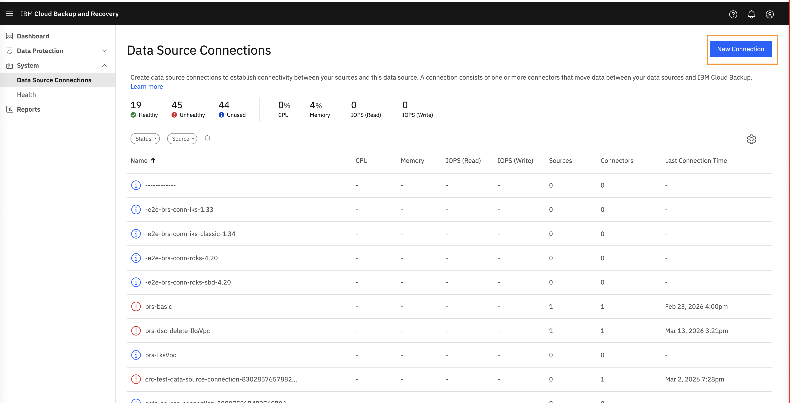
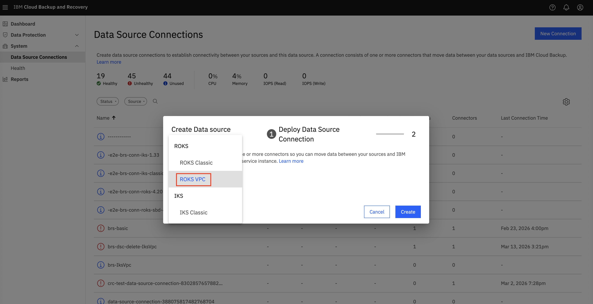
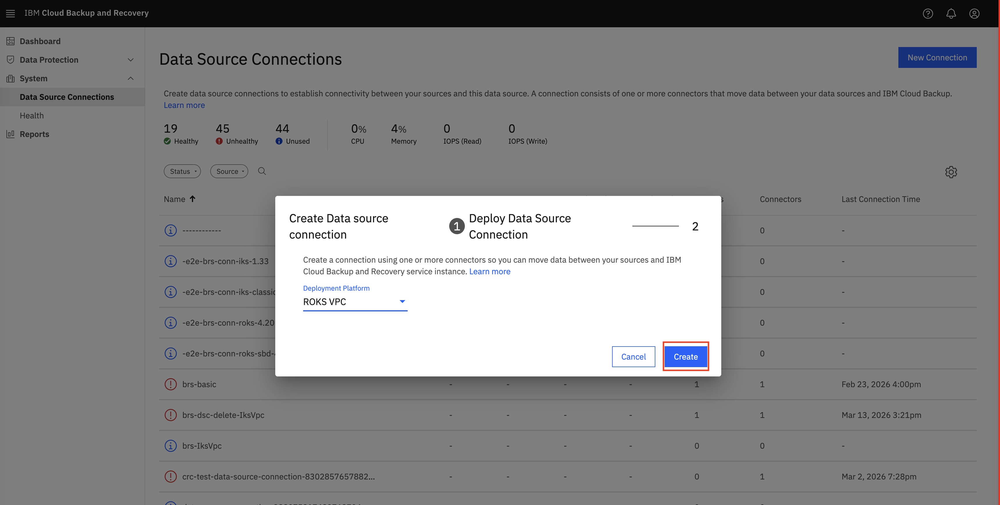
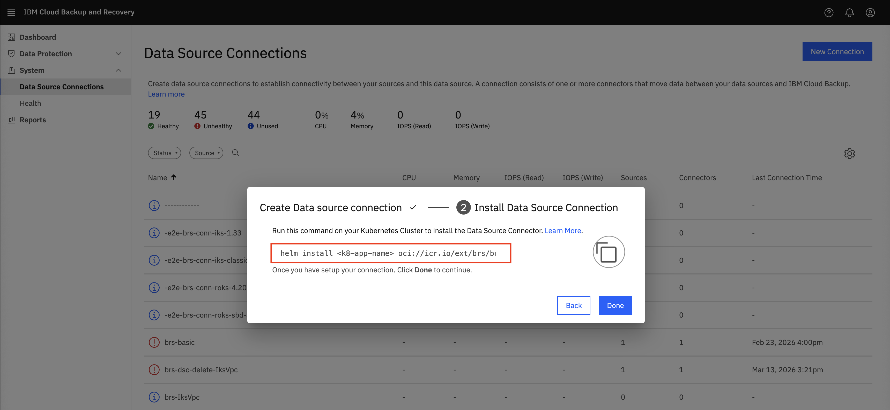
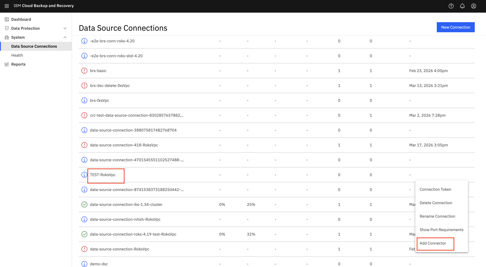
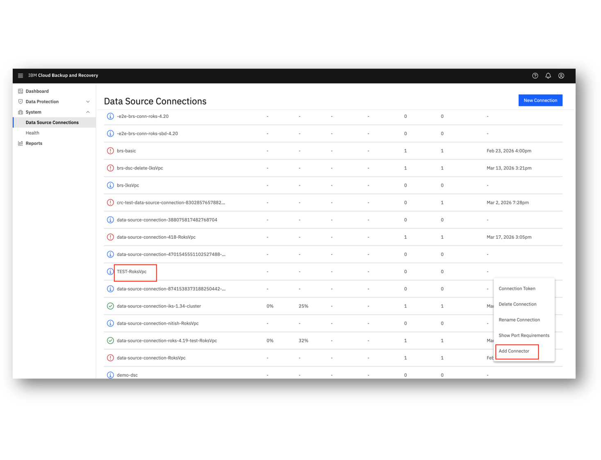

---

copyright:
  years: 2025
lastupdated: "2026-03-24"

keywords: data source connector, iks, roks, cluster

subcollection: backup-recovery


---

{{site.data.keyword.attribute-definition-list}}

# Register Kubernetes or OpenShift as a data source
{: #data-source-connector-iks-roks}

This information is provided for beta use only and is subject to change. Only the regions us-east, us-south, and eu-es are available now for this feature.
{: beta}

Located to the right of this page is a summary of key topics that are found on this page.
{: note}

## Quick reference to key sections for new users
{: #iks-roks-tutorial-quick-reference}

A. [Before you begin](#baas-getting-started-iks-roks)

B. Prerequisites for backup and restore:
   - You must have a [{{site.data.keyword.baas_full_notm}} instance that is created or create a new one](#data-source-connector-iks-roks-access-instance)
   - [Create or use existing data source connector](#data-source-connector-iks-roks-create-configure)
   - [Kubernetes or OpenShift cluster must be registered](#data-source-connector-iks-roks-register)

C. Take a backup of the Kubernetes or OpenShift cluster:
   - [Access {{site.data.keyword.baas_full_notm}} instance](#data-source-connector-iks-roks-access-instance)
   - [Create and configure data source connector](#data-source-connector-iks-roks-create-configure)
   - [Register source Kubernetes or OpenShift cluster](#data-source-connector-iks-roks-register)
   - [Create or schedule a backup](/docs/backup-recovery?topic=backup-recovery-protecting-namespace-iks-roks)

D. Restore backup to Kubernetes or OpenShift cluster:
   - [Access {{site.data.keyword.baas_full_notm}} instance](#data-source-connector-iks-roks-access-instance)
   - [Create and configure data source connector](#data-source-connector-iks-roks-create-configure)
   - [Register source Kubernetes or OpenShift cluster](#data-source-connector-iks-roks-register)
   - [Restore backup](/docs/backup-recovery?topic=backup-recovery-recovering-restoring-backup)

E. [Troubleshooting](/docs/backup-recovery?topic=backup-recovery-data-source-connector-iks-roks-troubleshooting)

## Before you begin
{: #baas-getting-started-iks-roks}

You need the following to get started with {{site.data.keyword.baas_full_notm}} with Kubernetes or OpenShift:
- An [{{site.data.keyword.cloud}} Platform account](https://cloud.ibm.com)
- An active instance of [{{site.data.keyword.baas_full_notm}} service](https://cloud.ibm.com/catalog/services/backup-and-recovery?catalog_query=aHR0cHM6Ly9jbG91ZC5pYm0uY29tL2NhdGFsb2cjaGlnaGxpZ2h0cw%3D%3D)

Alternatively, you can use the pre-built, open-source and enterprise-ready [Terraform IBM modules](/docs/ibm-cloud-provider-for-terraform?topic=ibm-cloud-provider-for-terraform-about-tim) with {{site.data.keyword.baas_full_notm}} service. These modules provide best practices for provisioning {{site.data.keyword.cloud_notm}} resources and can be referenced directly in your Terraform configurations.

## Accessing your {{site.data.keyword.baas_full_notm}} instances
{: #data-source-connector-iks-roks-access-instance}

1. Verify that your [IBM Cloud Platform account](https://cloud.ibm.com/){: external} has access to the required {{site.data.keyword.baas_full_notm}} service.
    1. Go to `Navigation Menu` \> `Backup and Recovery`.
    2. On the **Backup service instances** page, use the search bar to find your instance by name.
    3. Identify the instance with **Active** status and click its name.
    4. On the instance details page, click `Launch dashboard`.


## Backup requirements for Kubernetes or OpenShift clusters
{: #data-source-connector-iks-roks-backup-requirements}

Your Kubernetes or OpenShift cluster must be registered with the {{site.data.keyword.baas_full_notm}} instance to:

- Take backups
- Restore backups

## Backup and Restore compatibility
{: #data-source-connector-iks-roks-brs-comp}

You can back up and restore data on:

- The same Kubernetes or OpenShift cluster
- A different Kubernetes or OpenShift cluster within the same region
- An application running on a Kubernetes or OpenShift cluster
- Kubernetes or OpenShift cluster scoped resources, namespaces, and the resources within namespaces.

Clusters must be compatible, especially in terms of storage and network configuration.
{: note}

## Create or configure a data source connector
{: #data-source-connector-iks-roks-create-configure}

### Backup agents resource requirements
{: #data-source-connector-iks-roks-resource-reqs}

Ensure that the node has sufficient CPU and memory to run the {{site.data.keyword.baas_full_notm}} components (Data Source Connector, Datamover, and Velero). The following table lists their resource requirements.

| Pod Name                                   | CPU Requests | Memory Requests |
|--------------------------------------------|--------------|-----------------|
| Data Source Connector (per replica, default `replicaCount` is 3) | 2*3=6            | 5*3=15Gi             |
| Datamover (DaemonSet) | 500m*N         | 128Mi*N           |
| Velero                                     | 500m         | 128Mi           |


### Create a data source connection
{: #data-source-connector-iks-roks-create-data-source-connection}

1. Access the [{{site.data.keyword.baas_full_notm}} instance dashboard](#data-source-connector-iks-roks-access-instance).
2. Go to `Dashboard` > `System` > `Data Source Connections`.
3. Click `New Connection`.



4. In the **Create data source connection** wizard:
   - **Step 1: Create data source connection**:
     - Select the **Deployment Platform** (for example, **ROKS VPC**, **IKS VPC**, **ROKS classic**, **IKS classic**).

   

     - Click `Create`.

   

   - **Step 2: Install Data Source Connectors**:
     - Copy the provided `helm install` command. Save it securely, as you need it later.
     
  

     - Click `Done`.

5. (Optional) Manage the data source connection by using the **Actions** menu (three vertical dots):
   - **Rename Connection**: Change the connection name for easier identification.

   - **Add Connector**: Retrieve the `helm install` command to deploy connectors on the source cluster (kubernetes or Openshift).

   

    

    {: caption="Add connector"}

     {: caption="Add connector"}

   
### Configure a data source connector
{: #data-source-connector-iks-roks-create-configure}

1. In the [IBM Cloud Shell](https://cloud.ibm.com/shell) terminal, list the available Kubernetes or OpenShift clusters to identify the cluster name:
   From the output, note the cluster name where the Data Source Connector must be deployed to protect the cluster.

   ```sh
   ibmcloud ks cluster ls
   ```
   {: codeblock}


2. Download and configure the `KUBECONFIG` for the selected cluster with admin privileges:

   ```sh
   ibmcloud ks cluster config --cluster <cluster-name> --admin
   ```
   {: codeblock}

3. The Helm chart is hosted in the IBM Container Registry (ICR). Log in to the Helm or OCI registry by using the following command:

   ```sh
   helm registry login icr.io --username iamapikey --password "${API_KEY}"
   ```
   {: codeblock}

   If successful, you see a login confirmation.

4. Retrieve the `helm install` command that you copied earlier in the [Create a data source connection](#data-source-connector-iks-roks-create-data-source-connection) section. Update the command by adding the release name (for example, `dsc`). In the following example, `registrationToken` is masked:

   ```sh
   helm install dsc oci://icr.io/ext/brs/brs-ds-connector-chart --version 7.2.17-release-20260108-ed857f1c --namespace ibm-brs-data-source-connector --create-namespace --set secrets.registrationToken=xxxxxxx
   ```
   {: codeblock}

   We recommend deploying the data source connector in the `ibm-brs-data-source-connector` namespace using the `--namespace` and `--create-namespace` flags, as shown above. You can further customize the command with these optional flags:
   *   `--set fullnameOverride=<name>`: To give a specific name to the data source connector pods.
   *   `--set replicaCount=2`: To set the number of replicas (the default is 3).
   *   `--set volumeClaimTemplate.storageClass=<storage-class-name>`: To specify a custom storage class (default: `ibmc-vpc-block-metro-5iops-tier`).
   {: note}

5. Run the updated helm install command in the [IBM Cloud Shell](https://cloud.ibm.com/shell).

6. Check that the Helm release is installed:

   ```sh
   helm list -n ibm-brs-data-source-connector
   ```
   {: codeblock}


   Scaling down or deleting the Data Source Connector deployment (StatefulSet) does *not* automatically remove the Persistent Volume Claims (PVCs) or the underlying data. If you uninstall the connector, you must manually delete the PVCs (and potentially the PVs, depending on the reclaim policy).
   {: important}

## How to get the Kubernetes or OpenShift cluster endpoint
{: #how-to-get-iks-roks-endpoint}

1. Log in to the [IBM Cloud Console](https://cloud.ibm.com/){: external}.
2. Go to `Navigation Menu` \> `Containers` \> `Clusters`.
3. Select your cluster. You might need to filter by location (for example, _Washington DC_).
4. On the **Overview** page, scroll to the **Networking** section to find the **Private** and **Public** service endpoints.

## How to register a Kubernetes or OpenShift cluster with {{site.data.keyword.baas_full_notm}}
{: #data-source-connector-iks-roks-register}

If you are registering a cluster that was previously registered, you must ensure that any remnant `brs-backup-agent-<uuid>` namespaces are deleted from the cluster before proceeding. The presence of these namespaces will cause the new registration to fail.
{: important}

1. Access the [{{site.data.keyword.baas_full_notm}} instance dashboard](#data-source-connector-iks-roks-access-instance).
2. Go to: `Dashboard` \> `Data Protection` \> `Sources` \> click `Register Source`.
3. In the **Select Source** page, select the `Kubernetes Cluster (Beta)` tile and click `Start Registration`.
4. In the **Register Kubernetes Source** wizard:

    **Step 1: Data Source Connection**

    *   Select the previously created [Data Source Connection](#data-source-connector-iks-roks-create-data-source-connection), or create a new connection.
    *   Click `Continue`.

    **Step 2: Source Details**

    *   Enter the following details in the **Basic Information** section:

        |  Cluster Endpoint  |  Password-Bearer Token |  Kubernetes Distribution  |
        |----|----|----|
        | [Private (Recommended) or Public](#how-to-get-iks-roks-endpoint) | [See How to create a Bearer Token](#data-source-connector-iks-roks-create-bearer-token-cluster) | IBM Kubernetes Service / IBM Red Hat OpenShift Kubernetes Service |

        Make sure that **Kubernetes Distribution** matches the **Deployment Platform** of the selected Data Source Connection.

    *   (Optional) Configure Optional settings (for example, Service Type, Images) by expanding the **Optional** section.
         
         HostPort is the default communication method for the datamover, using port 33769 by default. Users can specify a custom 
         port if needed or choose NodePort or LoadBalancer, and switch between these options as required. The HostPort field is 
         optional and defaults to 33769 if not provided.

5. Click `Complete` to finish the registration.
6. You are redirected to the **Sources** page, where you can view the status of your registered cluster.

## How to create a bearer token for a Kubernetes or OpenShift cluster
{: #data-source-connector-iks-roks-create-bearer-token-cluster}

1. Open [IBM Cloud Shell](https://cloud.ibm.com/shell) and configure `kubectl` or `oc` CLI by getting the kube config:

    ```sh
    ibmcloud ks cluster config --cluster <cluster> --admin
    ```
    {: codeblock}

2. Create the service account and cluster role binding:

    ```sh
    kubectl create serviceaccount brs-sa -n default
    kubectl create clusterrolebinding brs-cl-role --clusterrole=cluster-admin --serviceaccount=default:brs-sa
    ```
    {: codeblock}

3. Create the secret and retrieve the bearer token:

    ```sh
    cat <<EOF > brs-sa-token.yaml
    apiVersion: v1
    kind: Secret
    metadata:
      name: brs-sa-token
      namespace: default
      annotations:
        kubernetes.io/service-account.name: brs-sa
    type: kubernetes.io/service-account-token
    EOF
    kubectl apply -f brs-sa-token.yaml
    ```
    {: codeblock}

    Wait a moment for the token to populate, then retrieve and decode it:

    ```sh
    kubectl get secret brs-sa-token -n default -o jsonpath='{.data.token}' | base64 --decode && echo ""
    ```
    {: codeblock}

## Protecting and Restoring Data
{: #protect-restore-data-iks-roks}

After registering your cluster, you can proceed to create Protection Groups and Policies to start backing up your data.

1. **Protect a Namespace**: See [Protecting a namespace or cluster](/docs/backup-recovery?topic=backup-recovery-protecting-namespace-iks-roks).
2. **Configure Policies**: See [Creating and configuring protection policies](/docs/backup-recovery?topic=backup-recovery-create-edit-standard-policy).
3. **Run Backups**: You can schedule backups via policies or trigger a backup immediately by using [Run Now](/docs/backup-recovery?topic=backup-recovery-protection-group-run-now).
4. **Restore Data**: To recover data, follow the instructions in [Recovering or restoring backup](/docs/backup-recovery?topic=backup-recovery-recovering-restoring-backup).

## Troubleshooting
{: #troubleshooting}

For issues related to Data Source Connector installation, registration failures, or pod scheduling, refer to the [Troubleshooting Guide](/docs/backup-recovery?topic=backup-recovery-data-source-connector-iks-roks-troubleshooting).
