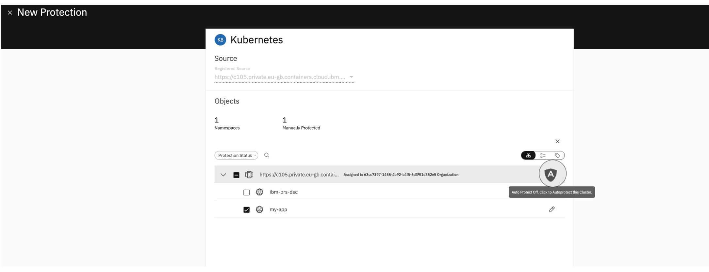
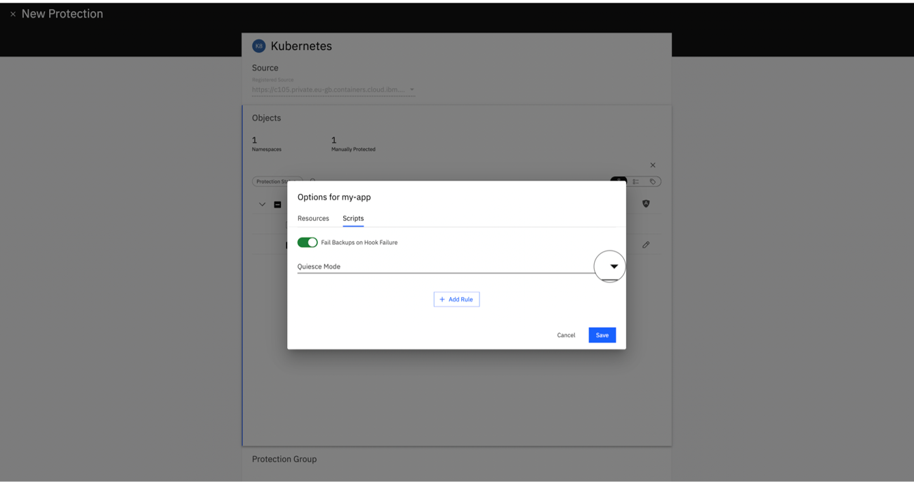

---

copyright:
  years: 2025, 2026
lastupdated: "2026-03-27"

keywords: data source connector, iks, roks, cluster, protection

subcollection: backup-recovery

---

{{site.data.keyword.attribute-definition-list}}

# Protecting a namespace or cluster and scheduling a backup
{: #protecting-namespace-iks-roks}

{{site.data.keyword.baas_full}} protects Kubernetes namespaces by assigning them to a policy‑driven Protection Group. This allows you to configure options like CSI snapshots, Auto Protect, label-based selection, and quiescing (pre and post-hooks) to help ensure consistent backups.

## Prerequisites for scheduling backups
{: #data-source-connector-iks-roks-prereq-schedule-bak}

1. You must have a [Protection Policy](/docs/backup-recovery?topic=backup-recovery-baas-policy-creation) in place to create or run a backup. You can either:
   - Use an existing protection policy, or
   - Create a new user-defined policy.

## How to protect a namespace or cluster
{: #protecting-namespace-iks-roks-schedule-backup-basic}

Follow these steps to quickly protect your Kubernetes resources:

1. Log in to the [IBM Cloud Console](https://cloud.ibm.com/){: external}.
2. Go to `Navigation Menu` \> `Backup and Recovery`.
3. On the **Backup service instances** page, use the search bar to find your instance by name.
4. Identify the instance with **Active** status and click its name.
5. On the instance details page, click `Launch dashboard`.
6. Go to: `Dashboard` \> `Data Protection` \> `Sources`.
7. Locate your Kubernetes source cluster by using the cluster endpoint.
8. Click the cluster endpoint. A list of available namespaces appears.
9. Choose the namespaces that you want to protect (or select the entire cluster).
10. Click `Protect` to further configure the protection settings.
11. **Select or Create a Protection Group**: When prompted, choose one of the following options:

      | Option | Description |
      |------|-------------|
      | **Use an Existing Protection Group** | All settings are prefilled from the existing group and are read only at this stage. |
      | **Create a New Protection Group** | When creating a new group, configure the following settings: <ul><li>**Protection Group Name**</li><li>**Protection Policy**</li><li>**Start Time and Time Zone** </li><li>**Leverage CSI Snapshot** (toggle)</li><li>**Pause Future Runs**</li><li>**Alerts and Email Recipients**</li><li>**Priority** (High / Medium / Low)</li><li>**Include or Exclude Labels**</li><li>**Description**</li></ul> |
      {: caption="Protection Group options" caption-side="bottom"}

12. **Select or Create a Protection Policy**:
    - **Create New**: Define backup frequency, retention, and other policy settings.
    - **Use Existing**: Select a policy, click `Edit` to update settings if needed, and save.

13. **Start Protection**: Click `Protect` to initiate protection. The service begins backing up selected objects according to the schedule. To monitor progress:
    - Go to `Data Protection` \> `Protection`.
    - Click the `Protection Group Name`.
    - Select a specific run by clicking its `Date and Time` to view detailed information.

## Configuration options
{: #protecting-namespace-iks-roks-advanced}

After you set up protection, you can customize the configuration to better suit your needs by following these steps:

1. Go to `Data Protection` \> `Protection`.
2. Click the `Protection Group Name`.
3. Click `Edit` in the menu `⋮` to update settings.

### 1. Settings
{: #configure-settings}

- **Start Time**: Defines when the protection job runs. (Time zone can also be selected here).
- **Leverage CSI Snapshot**: Toggle this option to protect PVC data by capturing a crash-consistent state of the volume by using CSI driver snapshots.

### 2. Additional settings
{: #configure-additional-settings}

When creating a new protection group, you find these under the collapsible **Additional Settings** section:

| Setting | Description |
|--------|-------------|
| **Pause Future Runs** | Toggle to enable. "Once enabled, no runs are scheduled." |
| **End Date** | Toggle to set a specific end date for protection runs. |
| **QoS Policy** | Select one of the following: <ul><li>Backup HDD (Default)</li><li>Backup SSD</li><li>Backup Auto</li></ul> |
| **Alerts** | Select events to trigger alerts: <ul><li>BCO Violation</li><li>Failure</li><li>Success</li></ul> Click `Add` to configure email recipients. |
| **Priority** | Sets execution priority: <ul><li>High</li><li>Medium</li><li>Low</li></ul> |
| **BCO (Backup Completion Objective)** | <ul><li>**Full**: Default 1 day.</li><li>**Incremental**: Default 12 hours.</li></ul>   _Backup Completion Objective (BCO) will be met if Full Backups complete within 1 day and Incremental Backups complete within 12 hours._ |
| **Description** | Enter a brief description for the Protection Group. |
| **Include or Exclude Labels** | Toggle **Persistent Volume Claim(PVC) Inclusion/Exclusion** to filter PVCs by labels.    <ul><li>**Logical Rule**: Select "Match Any of the following labels" or "Match All of the following labels".</li><li>Select **Include** or **Exclude** radio button.</li><li>Enter the **key** and **value** for the existing resource label.</li><li>Click **+ Add**.</li></ul> |
| **Snapshot Timeout** | Snapshot Timeout specifies the maximum time (in seconds) to wait for each PVC snapshot to reach the Ready state when CSI Snapshot is enabled. This setting is configured per protection job and applies to all subsequent runs. You can set a timeout value between 60 seconds and 43200 seconds.   <ol><li>Make sure that **Leverage CSI snapshot** is enabled.</li><li>Scroll down to locate the **Snapshot Timeout** field.</li><li>Enter the desired timeout value (in seconds) within the supported range (60-43200 seconds).</li><li>Click **Save** to apply the changes.</li></ol>|
{: caption="Additional settings" caption-side="bottom"}

### 3. Auto Protect
{: #auto-protect}

Auto Protect helps to ensure that any new namespaces added to the cluster in the future are automatically included in the protection group.

| Auto Protect Type | Steps |
|-----------------|-------|
| **Cluster‑Level Auto Protect** | <ol><li>Go to `Data Protection`.</li><li>Click `Sources`.</li><li>Go to **Kubernetes Source** section and locate your source by using the cluster endpoint.</li><li>Click **Menu** `⋮`.</li><li>Select `Protect`.</li><li>Click the **Shield Icon** on the cluster row.</li><li>Select `New Group` or `Existing Group`, configure the details, and then click `Protect`.</li></ol>  |
{: caption="Auto Protect types" caption-side="bottom"}

When Auto Protect is enabled:
- **New Namespaces**: Automatically added to the protection group if they match the criteria.
- **Deleted Namespaces**: Automatically excluded from future backups.
- **Existing Backups**: Preserved until retention expires.
- Existing namespaces can be updated and have their own inclusion/exclusion rules and pre/post hook scripts (Application Quiescing).

{: caption="Auto protect"}

### 4. Label-based inclusion and exclusion
{: #label-inclusion-exclusion}

You can fine-tune what gets backed up using labels.

Label-based filtering works alongside Auto Protect, enabling you to exclude specific namespaces even when the entire cluster is automatically protected.
{: note}

- **Exclude namespaces by a label**:
  1. Click the **Tags icon** (upper right) to switch to the label view.
  2. In the **Select Labels** dropdown, choose the labels that you want to filter by (for example, `kubernetes.io/metadata.name:my-label`). The list updates to show resources matching the selected labels.
  3. Click the **Exclude icon** (circle with slash) on the label row. The status changes to **Excluded** with a red icon, and all resources with that label are excluded from protection.
  4. Namespaces **not** excluded by these label rules remain in the list. Click `Protect` to proceed.

- **Customize individual namespaces**:
  1. Click the **pencil icon** next to a namespace to edit its settings.
  1. In the **Options for [namespace]** modal:
        - Toggle **Persistent Volume Claim(PVC) Inclusion/Exclusion** to enable customized filtering.

          This overrides the inclusion or exclusion settings that are made for Protection Group level in the Additional Settings.
          {: note}

        - Select **Include** or **Exclude** radio button.
        - Use the **Search** dropdown to select specific PVCs (for example, `primary-vol-brs-agent-connector-0`) to include or exclude.
        - (Optional) Toggle **Resource Inclusion/Exclusion** to filter other Kubernetes resources.
          - Select **Include** or **Exclude** radio button.
          - **Specific Resources**: Use the dropdown to select resources like `Daemon set`, `Deployment`, `Pod`, `Secret`, `Service`, etc.
          - **Custom Resources**: Click `+ Add Custom Resources` to specify custom resource definitions.
        - Pre/post hook scripts (Application Quiescing)

          

           

  1. Click `Save` to apply the changes.

### 5. Application quiescing
{: #application-quiescing}

{{site.data.keyword.baas_full_notm}} supports quiescing for consistent backups of stateful workloads.

**Supported quiescing modes:**

| Mode | Description |
|---|---|
| **Together mode** | Parallel execution within a single volume group. Faster than sequential. |
| **Independent mode** | Parallel execution across multiple volume groups. Fastest backup speed. |
| **Sequential mode** | Serial execution within a single volume group. Slowest but most controlled. |
{: caption="Supported Quiescing modes" caption-side="bottom"}

**Configure quiescing:**
1. Select the target namespace and click the **pencil icon** to edit.
2. Navigate to the **Scripts** tab.
3. Toggle **Fail Backups on Hook Failure** to control backup behavior on script errors.
4. Select a **Quiesce Mode**:
   - **Apply the following rules together** (Parallel execution within volume group)
   - **Apply the following rules independently** (Parallel execution across volume groups)
   - **Apply the following rules sequentially** (Serial execution)

{: caption="Application quiescing mode"}

5. Click `+ Add Rule` to define a new rule:
   - **Pod Selector Labels**: Click `+ Add Label` to select target pods where the pre and post script will execute.
   - **Pre Snapshot Scripts**: Click `+ Add Script` to define one or more commands to run before the snapshot.
   - **Post Snapshot Scripts**: Click `+ Add Script` to define one or more commands to run after the snapshot.
6. Click `Save` to apply the configuration.

Scripts run inside containers and have configurable timeouts. The script must be present within the container, and you must specify its absolute path to start it.
{: note}

## Running an on-demand backup
{: #run-protection-now}

You can manually trigger a backup at any time by using the **Run Protection Now** feature. For detailed instructions on running on-demand backups, see the [Protection group Run Now](/docs/backup-recovery?topic=backup-recovery-protection-group-run-now).

## Managing Protection Lifecycle
{: #managing-protection-lifecycle}

For detailed instructions on managing your backups, see [Managing Protection Group Runs](/docs/backup-recovery?topic=backup-recovery-protection-group-run-now). This includes:

- **Run Now**: Trigger an immediate backup.
- **Pause/Resume**: Temporarily stop or restart scheduled backups.
- **Delete**: Remove protection for an object (namespace). Can be object only or object and snapshots.

## **Known issues**
{: #known-issues-iks-roks}

### Snapshot Timeout resets to 300 seconds when toggling CSI Snapshot
{: #known-issue-snapshot-timeout-reset}

There is a known UI issue that affects the **Snapshot Timeout** field in a Protection Group:

- When the **Leverage CSI Snapshot** option is toggled **OFF** and then **ON** again,
  the **Snapshot Timeout value resets to the default `300` seconds**, even if a different value was previously configured.

#### How to reproduce
1. Open the Protection Group settings.
2. Enter a custom Snapshot Timeout value (for example, 1200 seconds).
3. Toggle **Leverage CSI Snapshot** OFF.
4. Toggle it ON again.

**Observed behavior:**
The Snapshot Timeout resets to **300 seconds**.

#### Workaround
- After enabling **Leverage CSI Snapshot**, **re-enter the desired Snapshot Timeout** (60–43200 seconds) before clicking **Save**.

This issue affects only the UI.
The backend uses the correct value once saved
