---

copyright:
  years: 2025, 2026
lastupdated: "2026-03-23"

keywords: data source connector, iks, roks, cluster, recover

subcollection: backup-recovery

---

{{site.data.keyword.attribute-definition-list}}

# Recover Kubernetes namespaces
{: #recovering-restoring-backup}

After protecting your Kubernetes namespaces, you can use {{site.data.keyword.baas_full_notm}} to recover them to::
- The original (same) Kubernetes or OpenShift cluster
- A different Kubernetes or OpenShift cluster that is registered with {{site.data.keyword.baas_full_notm}}

## Recover namespaces to the original or a different Kubernetes or OpenShift cluster
{: #recovering-same-location}

When you recover namespaces to their original location (the same Kubernetes or OpenShift cluster), or to a new location (different Kubernetes or OpenShift cluster) that is registered with the same {{site.data.keyword.baas_full_notm}} instance, only the resources, PVCs, or metadata that are **missing or deleted** are recovered from the selected snapshot. {{site.data.keyword.baas_full_notm}} does not overwrite existing resources.

For example, if a namespace that you want to recover contains a deployment resource and a service account, and the service account is missing but the deployment resource still exists, {{site.data.keyword.baas_full_notm}} recovers only the service account and skips the deployment resource.

## Steps to revover namespaces
{: #recovering-restoring-same-location}

1. Log in to the [IBM Cloud Console](https://cloud.ibm.com/){: external}.
2. Go to `Navigation Menu` \> `Backup and Recovery`.
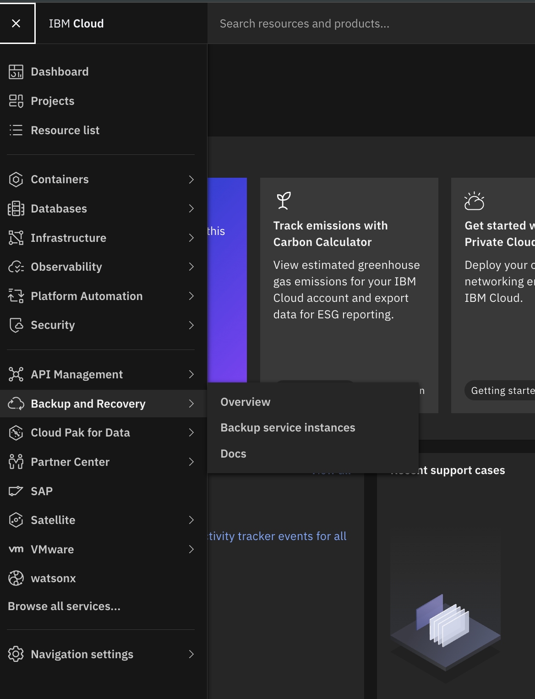
3. On the **Backup service instances** page, use the search bar to find your instance by name.
4. Identify the instance with **Active** status and click on the instance name.
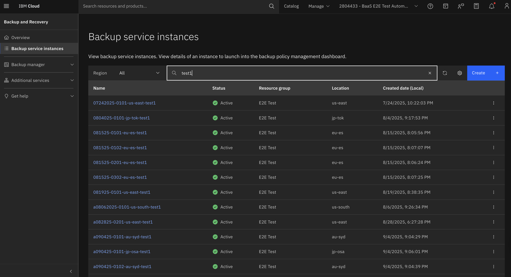
5. On the instance details page, click `Launch dashboard`.
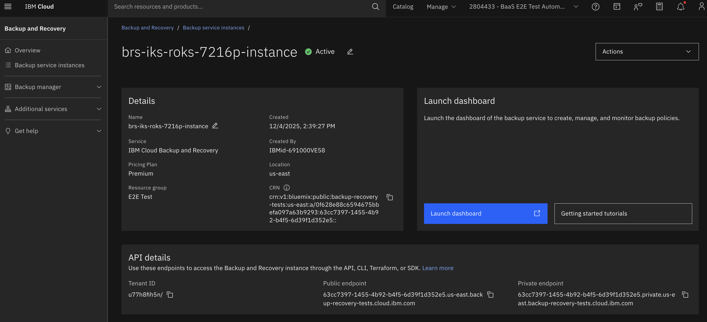
6. Go to `Dashboard` \> `Data Protection` \> `Recoveries`.
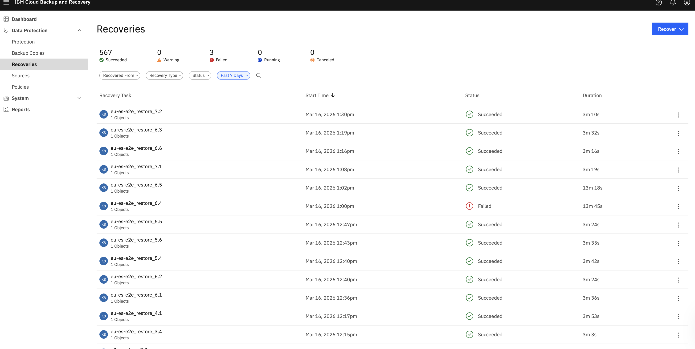
7. Click `Recover` in the upper-right corner and select `Kubernetes Cluster` \> `Namespace`.
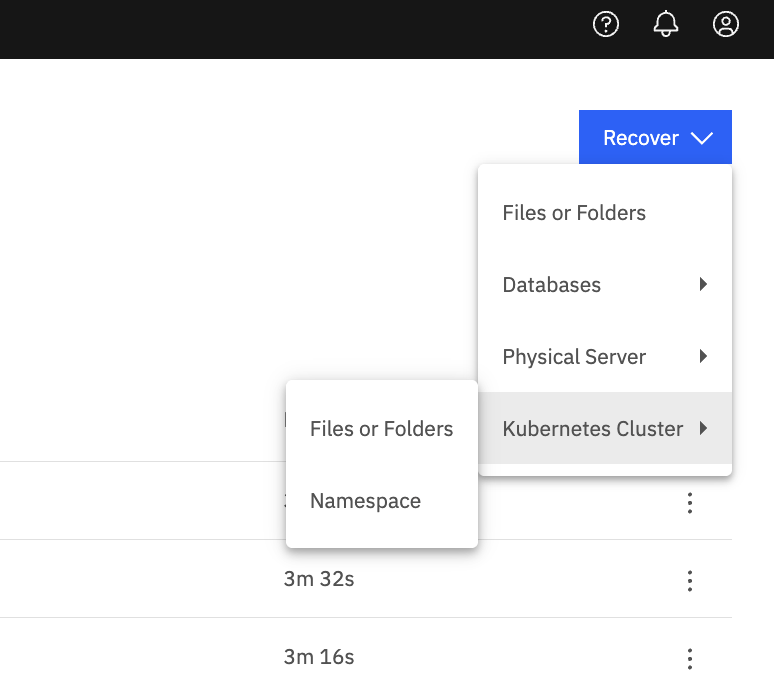
8. In the **New Recovery** modal:
    *   Search for the namespace or **Protection Group** you want to recover.
    *   You can enter the namespace name, Protection Group name, or use the wildcard character `*` for partial matches.
    *   Filter results by **Source**, **Protection Group**, or **date range**.
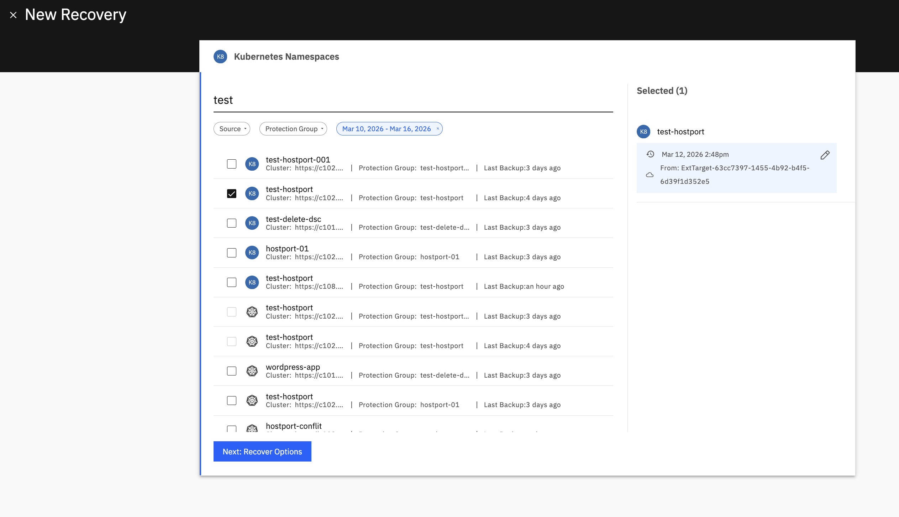

9. Identify the item that you want to recover. Items in the list are distinguished by their type:
    *   **Protection Groups**: Identified by a blue 'K8' icon. Represents a group of one or more namespaces.
    *   **Namespaces**: Identified by a gray hexagon icon. Represents an individual Kubernetes namespace.
    *   To recover the latest snapshot, select the checkbox next to the item name.
    *   To recover a specific snapshot:
        1. Click the **Edit** (pencil) icon next to the item name.
        2. In the recovery point selection view, select the snapshot that you want from the list.
        3. Click **Select Recovery Point**.

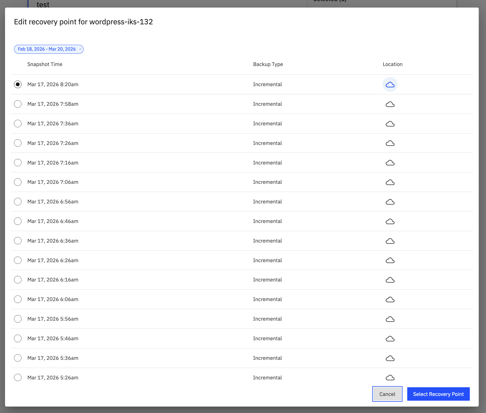

10. Click **Next: Recover Options**.
11. Under **Recover To**, select one of the following options:
    *   **Original Location** - Select **Original Location** to recover the namespace to the same cluster.
    *   **New Location** - Select **New Location** to recover the namespace to a different Kubernetes or OpenShift cluster. Under 
    **Registered Source**, select the destination Kubernetes or OpenShift cluster (or click **Register Source** to add a new one).
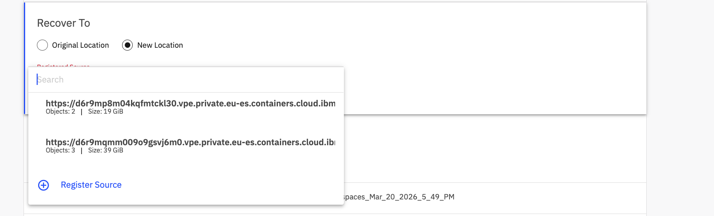
12. Configure the **Recovery Options** as needed:
    *   **Rename**: Add a **Prefix** or **Suffix** to the names of recovered namespaces. By default, the prefix `copy-` is added to the original namespace name.
    *   **Task Name**: View or customize the name of this recovery task.
    *   **Skip cluster compatibility check**: Toggle to enable or disable skipping the compatibility check for the target cluster. This option relates to Kubernetes version compatibility.
    *   **Include or Exclude Labels**: Filter **Persistent Volume Claim(PVC)** based on labels.
        *   **Logical Rule**: Select **Match Any of the following labels** or **Match All of the following labels**.
        *   Choose to **Include** or **Exclude** matched labels.
        *   Enter the label **key** and **value**, then click **+ Add**.
    *   **Cluster Resources**:
        *   Toggle **Include Cluster Level Resources** to recover cluster-scoped resources.
        *   **Warning**: Recovering cluster resources can create conflicts. Proceed with caution.
        *   Select the **Snapshot with Cluster Resource** from the dropdown if multiple are available.
    *   **Namespace Resources**: Choose specific resources to recover. Click the **edit** icon to customize:
        *   **Resources** Tab:
            *   Toggle **Resource Inclusion/Exclusion** to Include or exclude specific resource types.
            *   Select **Include** or **Exclude** radio buttons.
            *   Use the search bar or click **+ Add** to filter by resource type (for example, `Deployment`, `ReplicaSet`).
        *   **Storage Class** Tab:
            *   Toggle **Unbind the PVCs from their original PV mapping** if needed.
            *   Map **Old Storage Class** to **New Storage Class** by using the dropdowns.
            *   Use **Clear All** to reset mappings.
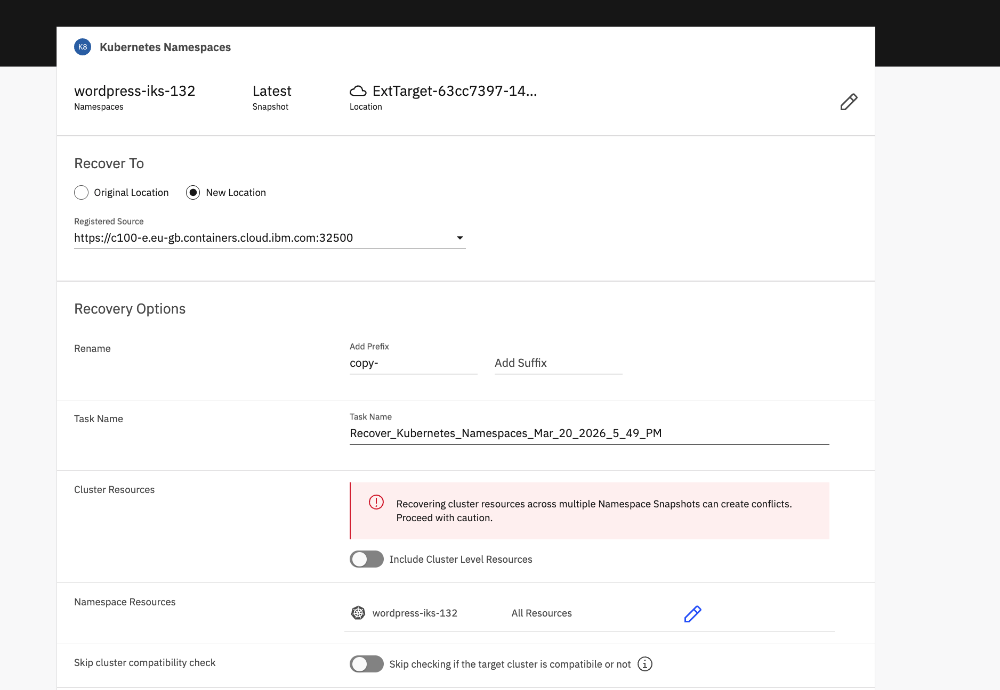
    **Alternative Region/Zone Recovery** (applicable when recovering to a different cluster): {{site.data.keyword.baas_full_notm}} supports recovering to a different region or zone.
    *   **Region Mapping**:
        *   Specify the **Source** region and the **Target** region.
    *   **Zone Mapping**:
        *   Specify the **Source** zone and the **Target** zone.
        *   Click the **+** icon (if available) to add multiple zone mappings.
    *   These mappings automatically update Storage Classes, Secrets, and PersistentVolumes during recovery.
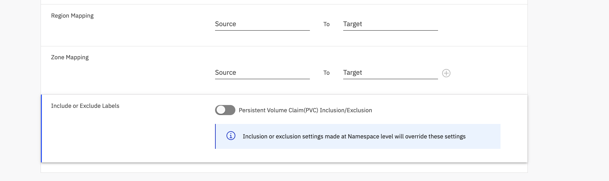
13. Click **Recover**. You can monitor the progress on the **Recoveries** page.
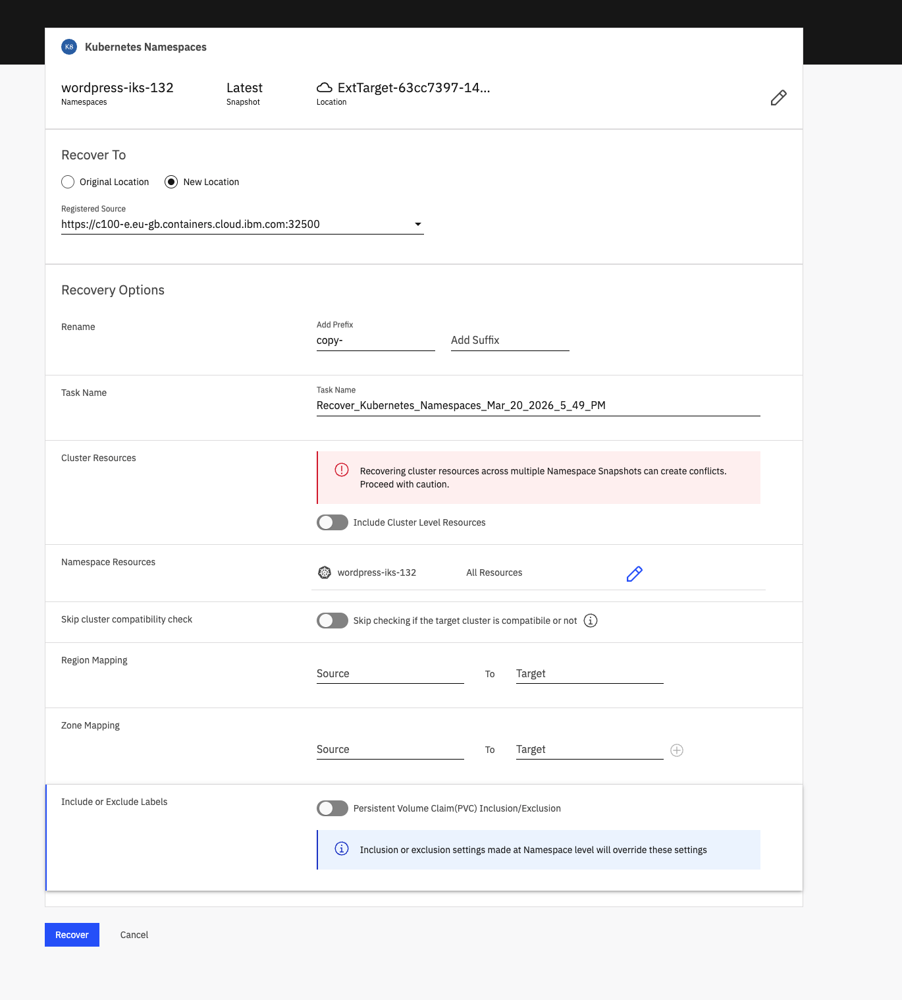
## Monitoring recoveries
{: #monitoring-recoveries}

You can track the status of your recovery tasks on the **Recoveries** page.

*   **Recovery list details**: The list displays key information for each task, including:
    *   **Recovery Task**: Name of the task.
    *   **Start Time**: When the task was initiated.
    *   **Status**: Current state of the recovery.
    *   **Duration**: How long the task took to complete.

*   **Dashboard overview**: View a summary of recovery tasks by status:
    *   **Succeeded**: The recovery task completed successfully.
    *   **Warning**: The task completed with warnings.
    *   **Failed**: The task failed to complete.
    *   **Running**: The task is currently in progress.
    *   **Canceled**: The task was manually canceled.

*   **Filtering**: Use the available filters to narrow down the list of recoveries:
    *   **Recovered From**: Filter by source type (for example, **Cloud Archive**, **Local**, **Tape Archive**).
    *   **Recovery Type**: Filter by the type of data recovered (for example, **Files and Folders**, **Kubernetes**, **Microsoft SQL**, **Oracle**, **Physical Server**, **VMware**, **SAP HANA**, **Instana**, **Etcd**, **Volume**).
    *   **Status**: Filter by task status (for example, **Running**, **Succeeded**, **Warning**, **Failed**, **Canceled**, **Canceling**, **Skipped**, **Accepted**, **Finalizing Migration**, **In Sync**, **Migrating**, **Migration Finalized**).
    *   **Date Range**: Select a time period such as **Past Hour**, **Past 12 Hours**, **Past 24 Hours**, **Past 7 Days**, **Past 30 Days**, or a **Custom** range.

## Recovery UI Features
{: #recovery-ui-features}

| Feature | Description |
|--------|-------------|
| **Rename** | Allows you to rename the namespace in the destination cluster, creating a restoration with a custom name. |
| **Task Name** | Assigns a custom name to the recovery task for easier identification and tracking in the workflow. |
| **Cluster Resources** | Specifies which cluster-scoped resources to include in the migration. These are recovered at the cluster level in the destination. |
| **Namespace Resources** | Limits recovery to specific resources existing in the source namespace. You can also filter PVCs and related resources for inclusion/exclusion. |
| **Skip cluster compatibility check** | Bypasses version validation between source and destination clusters. Useful when restoring between different cluster types (for example, ROKS to IKS). |
| **Region Mapping** | Updates region parameters in custom StorageClasses during recover, creating them with new region values in the destination. |
| **Zone Mapping** | Updates zone parameters in custom StorageClasses during recover, applying new zone values in the destination. |
| **Include/Exclude Labels** | Filters PersistentVolumeClaims (PVCs) by label, allowing you to include or exclude specific PVCs from the migration. |
{: caption="Recovery UI features" caption-side="bottom"}
