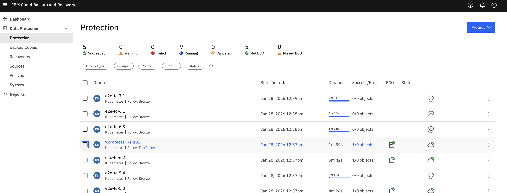
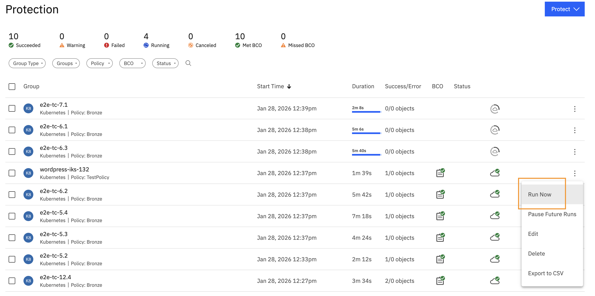
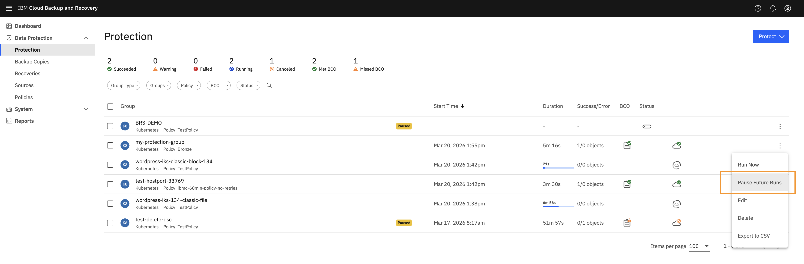
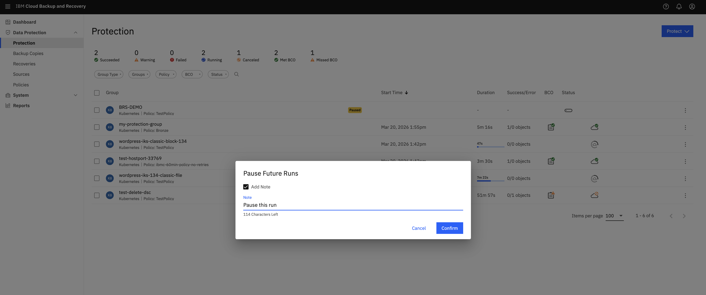
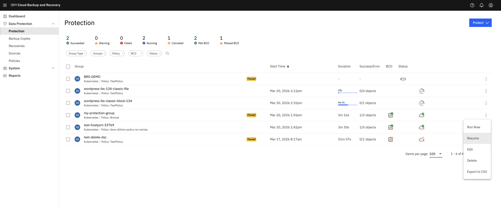
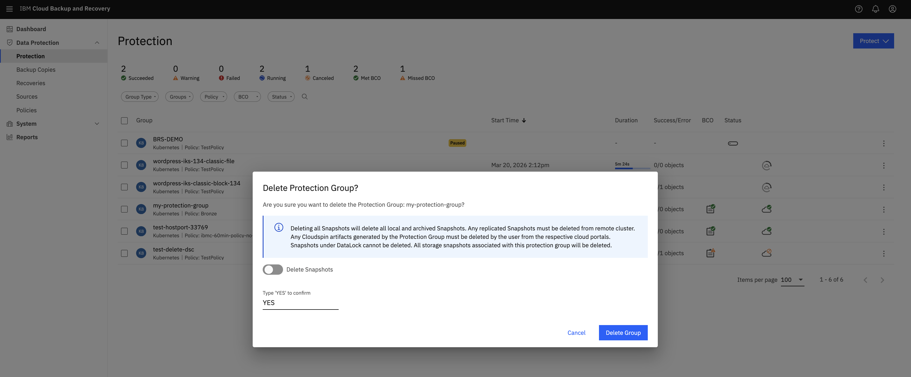
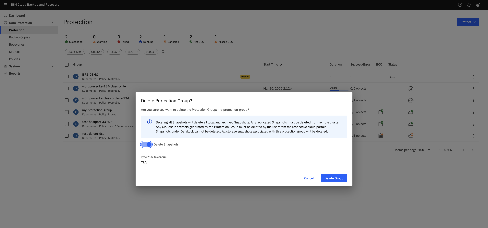
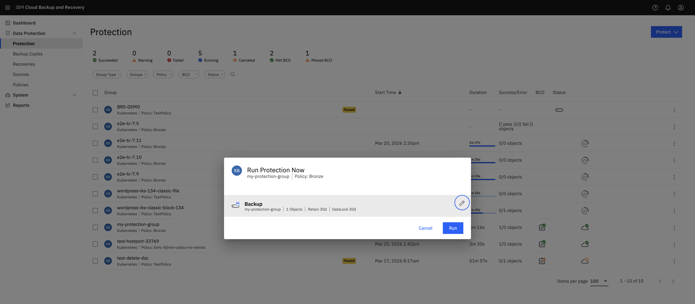

---

copyright:
  years: 2025, 2026
lastupdated: "2026-03-23"

keywords: data source connector, iks, roks, cluster, run now

subcollection: backup-recovery

---

{{site.data.keyword.attribute-definition-list}}

# Protection group Run Now
{: #protection-group-run-now}

The **Run Now** feature allows you to immediately start a backup for the objects included in a Protection Group, without waiting for a scheduled policy.
This is useful for:

- Testing backups
- Taking an on‑demand snapshot before changes
- Rerunning backups after a failure
- Capturing incremental changes quickly

When you click **Run Now**, the system presents different backup options based on the protection group configuration and the state of the last backup.
You can manually start a protection that is run for the Kubernetes namespaces (objects) in your cluster. It provides you with options to:

- Back up all objects or only selected objects.
- Select an incremental or full backup.

## Starting a protection run
{: #protection-starting-run}

1. In the {{site.data.keyword.baas_full_notm}} instance dashboard, navigate to `Data Protection` \> `Protection`.

1. On the **Protection** page, locate the protection group that you want to run the backup for.
1. Click the **Actions** icon `⋮` and select `Run Now`. In the **Run Protection Now** modal configure the following options:

      | Setting | Option | Description |
      |---|---|---|
      | **Backup** | **All objects in protection group** | Backs up all defined resources. |
      | | **All objects that succeeded last run** | Backs up objects that were successfully protected in the previous run. |
      | | **Selected objects in the protection run** | Allows you to choose specific objects to back up. |
      | **Backup Type** | **Incremental** | Captures only changes since the last backup (faster). |
      | | **Full** | Captures a complete copy of all objects and data in the protection group, regardless of previous backup history. |
      {: caption="Configuration optons" caption-side="bottom"}

1. Click `Run Now` to start the job.

## Pause future runs
{: #iks-roks-pause-run}

You can pause future scheduled runs for the objects in a protection group. If a protection run is currently executing, it continues to completion, and only subsequent scheduled runs are paused.

To pause future runs:

1. In the {{site.data.keyword.baas_full_notm}} instance dashboard, navigate to **Data Protection** \> **Protection**.
2. On the **Protection** page, locate the protection group that you want to pause.
3. Click the **Actions** icon `⋮` and select `Pause Future Runs`.

## Resume paused protection runs
{: #iks-roks-resume-run}

You can resume a paused protection run at any time. When you resume, if the previous backup snapshots have expired, a full backup might be triggered.

To resume a paused protection run:

1. In the {{site.data.keyword.baas_full_notm}} instance dashboard, navigate to `Data Protection` \> `Protection`.
2. On the **Protection** page, locate the protection group that you want to resume.
3. Click the **Actions** icon `⋮` and select `Resume`.

## Delete Protection Group
{: #iks-roks-delete-object}

You can delete a protection group if you:

- No longer want to retain the backups and snapshots that are generated for it.
- Want to reclaim the storage space used by the objects in the group.

You can delete a protection group in two ways:

- **Delete Object Only**: Removes the protection group from {{site.data.keyword.baas_full_notm}} management but preserves all existing backups until they expire naturally.

- **Delete Object and Snapshots**: Removes the protection group and immediately deletes all its local and archived snapshots.

After deleting a protection group and its snapshots, the reclaimed storage space might take some time to appear on the {{site.data.keyword.baas_full_notm}} Dashboard.

To delete a protection group:

1. In the {{site.data.keyword.baas_full_notm}} instance dashboard, navigate to `Data Protection` \> `Protection`.
2. On the **Protection** page, locate the protection group that you want to delete.
3. Click the **Actions** icon `⋮` and select `Delete`. (Note: The protection group is deleted only if the backup is paused).
4. In the **Delete Protection Group?** dialog box, perform the following:
   - **Delete Snapshots**: Toggle to enable if you want to delete all snapshots associated with this protection group. If disabled, only the protection group is removed, and existing snapshots are retained until they expire.
   - **Confirm**: Type `YES` in the text box to confirm the action.
5. Click `Delete Group`.

## Backup types available under Run Now
{: #iks-roks-backup-types-run-now}

When triggering a manual backup, you might see the following backup types available:

| Backup Type | Details |
|--------|---------|
| **Full Backup** | Captures all selected data regardless of previous backup history. <ul><li>**Scope**: Can run for all objects, selected objects, or objects that succeeded in the last run.</li><li>**Suggested use**: Complete data copy, first backup of a new protection group, or to reset the incremental chain.</li></ul> |
| **Incremental Backup** | Captures only changed data since the last successful backup. <ul><li>**Scope**: Can run for all objects, selected objects, or succeeded objects (only if previous run had partial or full success).</li><li>**Suggested use**: Quick backups to protect recent changes.</li></ul> |
{: caption="Backup types" caption-side="bottom"}

<figure>
  
  <figcaption> Figure 5.1 Run now options.</figcaption>
</figure>

<figure>
  
  <figcaption> Figure 5.2 Incrmental or full backup.</figcaption>
</figure>

<figure>
  
  <figcaption> Figure 5.3 The scope of the objects to be backed up.</figcaption>
</figure>
